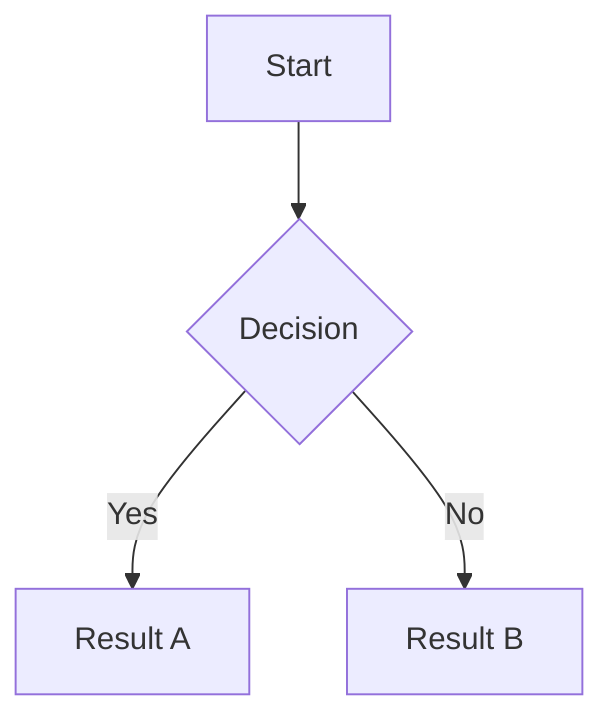

Writer's editor renders a superset of standard CommonMark markdown. On top of the core spec it adds GitHub Flavored Markdown extensions (tables, strikethrough, task lists), wiki-style internal links with alias and heading-fragment support, YAML frontmatter, and inline Mermaid diagram rendering. All syntax is rendered live in the editor without switching to a separate preview pane.

## Standard syntax

### Headings

```markdown
# Heading 1
## Heading 2
### Heading 3
#### Heading 4
##### Heading 5
###### Heading 6
```

### Bold and italic

```markdown
**bold text**
*italic text*
***bold and italic***
```

### Links

```markdown
[link text](https://example.com)
```

### Images

```markdown

```

### Inline code

```markdown
Use `backticks` for inline code.
```

### Code fences

````markdown
```javascript
const greeting = "Hello, world!";
```
````

### Blockquotes

```markdown
> This is a blockquote.
> It can span multiple lines.
```

### Bullet lists

```markdown
- First item
- Second item
  - Nested item
```

### Numbered lists

```markdown
1. First item
2. Second item
3. Third item
```

### Task lists

```markdown
- [ ] Unchecked task
- [x] Completed task
```

Task checkboxes are styled with the accent color and can be toggled by clicking.

## Extended syntax

### Tables (GFM)

```markdown
| Column A | Column B | Column C |
| -------- | -------- | -------- |
| Cell 1   | Cell 2   | Cell 3   |
| Cell 4   | Cell 5   | Cell 6   |
```

Columns lay out at their natural widths and the table scrolls horizontally when content overflows, so long words in a single cell do not squeeze the other columns.

### Strikethrough

```markdown
~~struck-through text~~
```

### Frontmatter

YAML frontmatter is supported at the top of a file, delimited by `---`. It is rendered in a dedicated panel above the editor body rather than as raw text.

```markdown
---
title: My Note
date: 2026-05-01
tags: [writing, reference]
---

Note body starts here.
```

Typing `---` at the very top of a new document mounts the frontmatter panel with an empty row focused. When the last row is removed, the `---` block is deleted from disk automatically.

### Wiki-links

Writer supports Obsidian-style wiki-links for linking between notes in the same workspace.

**Basic wiki-link:**

```markdown
[[note name]]
```

**Wiki-link with display alias:**

```markdown
[[target note|display text]]
```

**Wiki-link to a heading fragment:**

```markdown
[[note name#Heading]]
```

<Note>
  Autocomplete suggestions appear as you type `[[`. The popover lists matching files in the workspace and closes on selection or `Esc`.
</Note>

### Extensionless and trailing-slash links

Standard markdown links without a file extension or with a trailing slash resolve to workspace files, so imported corpora such as Obsidian vaults and documentation repositories open without needing to rewrite every link.

```markdown
[My Note](my-note)
[Folder index](guides/)
```

### Mermaid diagrams

Fenced code blocks tagged `mermaid` are rendered as inline SVG diagrams directly in the editor. Diagrams adapt to the current light or dark theme using a monochrome palette.

````markdown

````

Diagram height is cached so diagrams do not collapse and re-expand as they scroll in and out of the editor viewport.

## Related

<CardGroup cols={2}>
  <Card title="Editor" icon="pen-to-square" href="/features/editor">
    How the editor renders and formats markdown.
  </Card>
  <Card title="Keyboard shortcuts" icon="keyboard" href="/reference/keyboard-shortcuts">
    Shortcuts for applying markdown formatting without leaving the keyboard.
  </Card>
  <Card title="Theming" icon="palette" href="/features/theming">
    Customize how the editor looks with themes and color tokens.
  </Card>
  <Card title="Workspace" icon="folder-open" href="/features/workspace">
    Managing files and folders in a Writer workspace.
  </Card>
</CardGroup>
